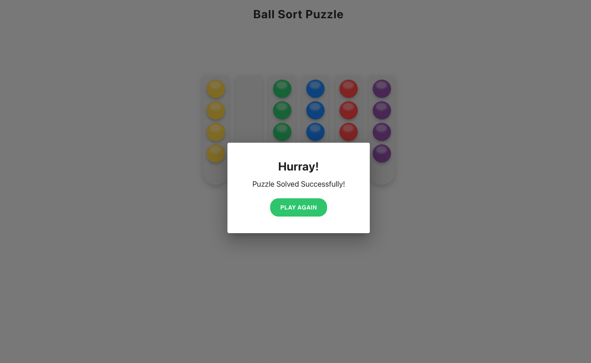

# 🧪 Ball Sort Puzzle

A simple and fun **Ball Sort Puzzle Game** built using **React**, **Material UI**, and **react-beautiful-dnd**.

The goal of the game is to sort balls so that each tube contains balls of only one color.

---

## 🎮 Game Rules

- Each tube can hold **4 balls**.
- You can drag and drop balls between tubes.
- Only move balls into tubes that have space.
- The puzzle is solved when:
  - Every tube contains balls of a single color, and
  - Remaining tubes are empty.

When solved, a **Hurray modal** appears and you can restart the game.

---

## ✨ Features

- Random puzzle generated every game
- Drag & drop interaction
- Smooth UI with gradient balls
- Win detection modal
- Restart / Play Again button
- Clean component structure
- Centralized styling using MUI styled API

---

## 🛠 Tech Stack

- React
- Material UI (MUI)
- react-beautiful-dnd
- Emotion styled components

---

## 🚀 Getting Started

### Installation

1. Install dependencies:

   ```bash
   npm install

   ```

2. To run the development server:

   ```bash
   npm start
   ```

## Application Output


